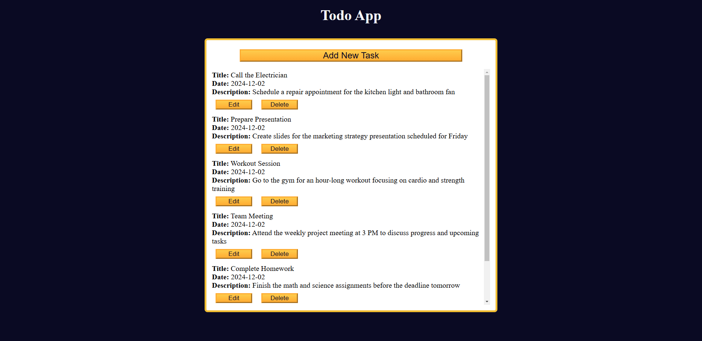

# Todo App

## Overview

This project demonstrates how to build a simple Todo application that allows users to add, edit, and delete tasks. The tasks are stored persistently using the browser’s `localStorage`, so they remain even after the page is refreshed. The app is built with HTML, CSS, and JavaScript.

## Features

- Add new tasks with a title, date, and description.
- Edit existing tasks.
- Delete tasks from the list.
- Persist tasks using `localStorage` for permanent storage even after refreshing the page.
- Responsive design that adapts to both mobile and desktop screens.

## Technologies Used

- **HTML**: For structuring the webpage.
- **CSS**: For styling and responsive design.
- **JavaScript**: For handling task logic and interacting with `localStorage`.

### JavaScript

The `script.js` file includes:
- Functions to add, edit, delete, and update tasks.
- Local storage logic to persist task data.
- Event listeners to manage user interactions such as opening the task form and submitting tasks.

## Usage

1. Clone the repository or download the files.
2. Open `index.html` in a browser.
3. To manage tasks, you can:
   - **Add a Task**: Click on the "Add New Task" button, fill out the form, and submit.
   - **Edit a Task**: Click the "Edit" button next to any task to modify it.
   - **Delete a Task**: Click the "Delete" button next to any task to remove it from the list.

## Screenshot of the page

Below is an example of the Todo app displaying a list of tasks:

